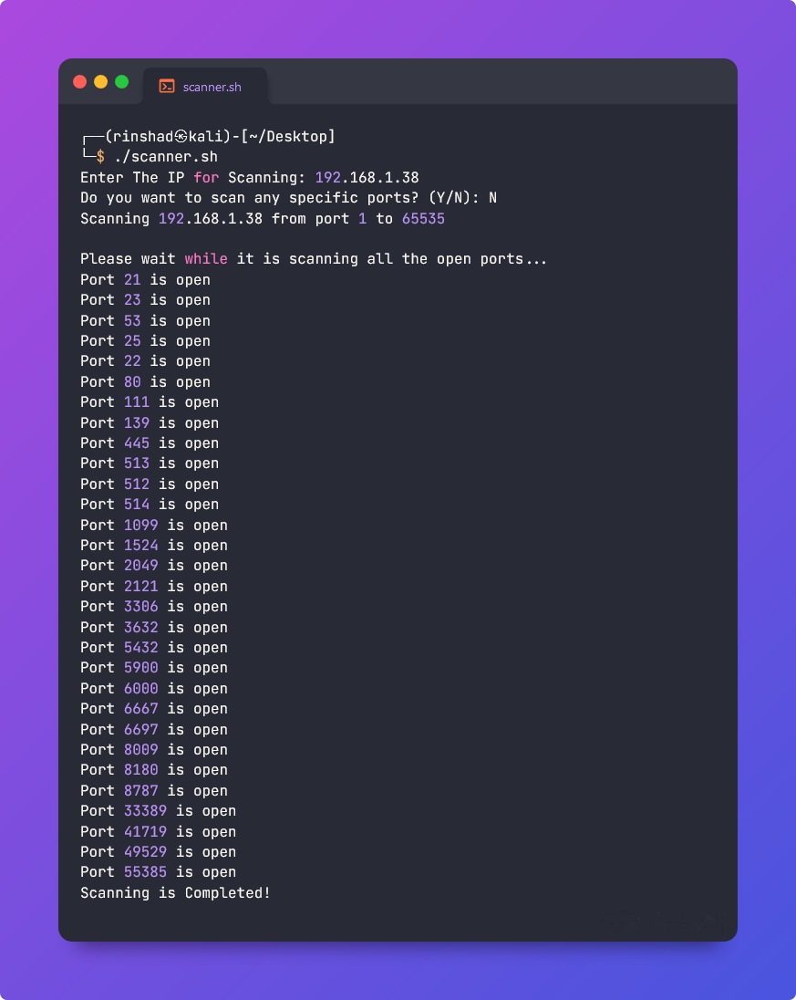

# Port Scanner Using Bash Script
This is a simple Port Scanner using BASH Script.It can scan a specified IP address for open ports. It first prompts the user for the IP address to scan and then asks if they want to scan any specific ports. If the user enters yes, it prompts them for the starting and ending ports to scan. The script then scans the specified IP address from the starting port to the ending port and prints a message to the console for each open port.
## Run Locally  
Clone the project  

~~~bash  
  https://github.com/rinshad-p/Port-Scanner
~~~

Go to the project directory  

~~~bash  
  cd Port-Scanner
~~~

Grants the execute permission to the  Script

~~~bash  
  chmod +x scanner.sh
~~~

## Usage/Examples  
~~~bash  
  ./scanner.sh
~~~

## Screenshots  
  
